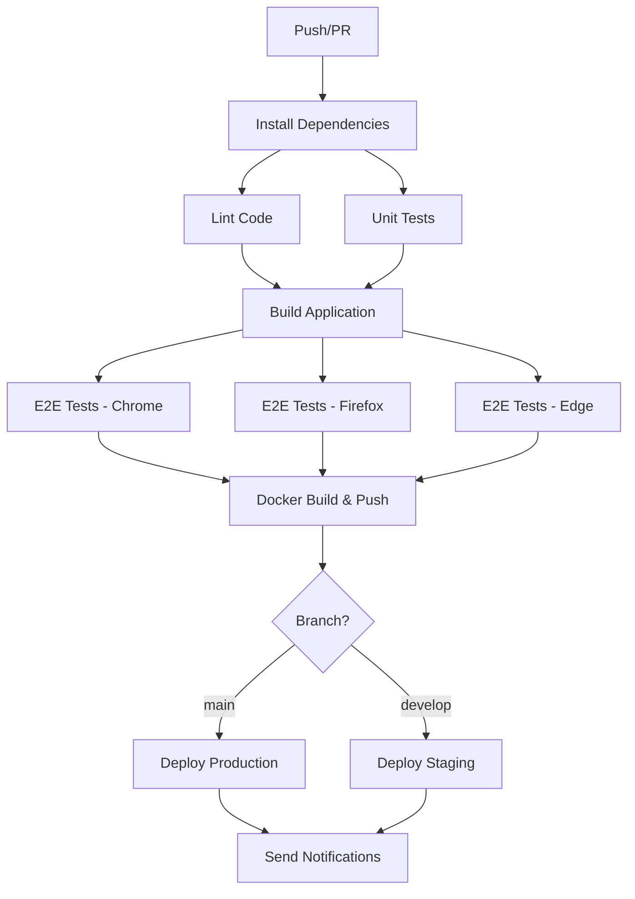
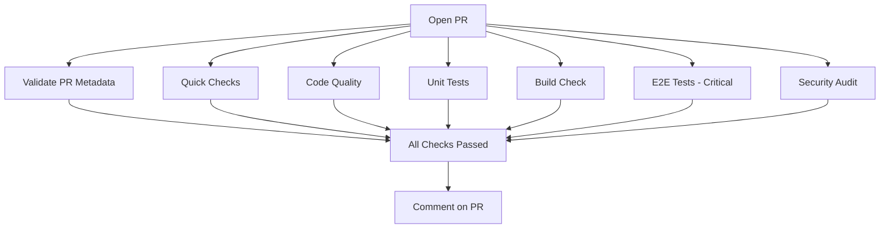

# CI/CD Quick Start Guide

This guide will help you quickly set up and deploy the CI/CD pipeline for the Gameboy project.

## Prerequisites

- Node.js 18 or higher
- npm
- Git
- Docker (optional but recommended)
- GitHub account
- Vercel account

## Quick Setup (5 minutes)

### 1. Clone and Setup Project

```bash
# Clone the repository
git clone https://github.com/ShahSau/gameboy.git
cd gameboy

# Install dependencies
npm install

# Run setup script
chmod +x setup-cicd.sh
./setup-cicd.sh
```

### 2. Configure GitHub Repository

#### Enable GitHub Actions
1. Go to your repository on GitHub
2. Click on "Actions" tab
3. Click "I understand my workflows, go ahead and enable them"

#### Add GitHub Secrets

Navigate to: `https://github.com/YOUR_USERNAME/gameboy/settings/secrets/actions`

**Required Secrets:**

| Secret Name | How to Get | Description |
|------------|-----------|-------------|
| `VERCEL_TOKEN` | [Vercel Account → Settings → Tokens](https://vercel.com/account/tokens) | Create a new token |
| `VERCEL_ORG_ID` | Run `vercel link` then check `.vercel/project.json` | Your Vercel organization ID |
| `VERCEL_PROJECT_ID` | Run `vercel link` then check `.vercel/project.json` | Your Vercel project ID |

**Optional Secrets (for enhanced features):**

```bash
# Cypress Dashboard (for test recording)
CYPRESS_RECORD_KEY=your-key-here

# Codecov (for coverage reporting)
CODECOV_TOKEN=your-token-here

# Snyk (for security scanning)
SNYK_TOKEN=your-token-here

# Slack (for notifications)
SLACK_WEBHOOK=your-webhook-url
```

### 3. Get Vercel Credentials

```bash
# Install Vercel CLI globally
npm i -g vercel

# Login to Vercel
vercel login

# Link your project
vercel link

# Get your project details
cat .vercel/project.json
```

Copy the `orgId` and `projectId` values to GitHub secrets.

### 4. Copy Workflow Files

```bash
# Create workflows directory
mkdir -p .github/workflows

# Copy workflow files from the setup
cp ci-cd.yml .github/workflows/
cp pr-checks.yml .github/workflows/
cp docker-security.yml .github/workflows/

# Copy Docker files to project root
cp Dockerfile .
cp Dockerfile.dev .
cp docker-compose.yml .
cp nginx.conf .
cp .dockerignore .
```

### 5. Commit and Push

```bash
# Add all files
git add .

# Commit
git commit -m "ci: add CI/CD pipeline with GitHub Actions and Docker"

# Push to main branch
git push origin main
```

## Verify Setup

### 1. Check GitHub Actions

1. Go to `https://github.com/YOUR_USERNAME/gameboy/actions`
2. You should see the "CI/CD Pipeline" workflow running
3. Wait for all jobs to complete (usually 5-10 minutes)

### 2. Check Deployment

1. Once the workflow completes, check your Vercel dashboard
2. Your app should be deployed at `https://gameboy-ruddy.vercel.app`
3. Visit the URL to verify the deployment

### 3. Test Pull Request Workflow

```bash
# Create a new branch
git checkout -b feature/test-cicd

# Make a small change
echo "# CI/CD Test" >> README.md

# Commit and push
git add README.md
git commit -m "docs: test CI/CD pipeline"
git push origin feature/test-cicd

# Create PR on GitHub
# Go to GitHub and create a pull request
```

The PR checks will automatically run!

## Common Commands

### Local Development

```bash
# Start dev server
npm run dev

# Run unit tests
npm run test

# Run tests in watch mode
npm run test:watch

# Run E2E tests
npm run cypress:open

# Build for production
npm run build
```

### Docker Commands

```bash
# Build Docker image
docker build -t gameboy:latest .

# Run container
docker run -p 8080:8080 gameboy:latest

# Run with Docker Compose (production)
docker-compose up gameboy-app

# Run with Docker Compose (development with hot reload)
docker-compose --profile dev up gameboy-dev

# Run Cypress tests in Docker
docker-compose --profile test up cypress

# Stop all containers
docker-compose down
```

### Testing Commands

```bash
# Run all unit tests
npm test

# Generate coverage report
npm run test:coverage

# Run Cypress tests headless
npm run cypress:run

# Run specific Cypress test
npm run cypress:run -- --spec "cypress/e2e/navigation.cy.ts"
```

## Workflow Triggers

### Automatic Triggers

- **Push to `main`** → Full CI/CD + Production deployment to Vercel
- **Push to `develop`** → Full CI/CD + Staging deployment to Vercel
- **Pull Request** → PR validation checks + subset of tests
- **Daily at 2 AM UTC** → Security scans

### Manual Triggers

1. Go to "Actions" tab
2. Select desired workflow
3. Click "Run workflow"
4. Choose branch
5. Click "Run workflow" button

## Pipeline Stages

### Main CI/CD Pipeline



### Pull Request Checks



## Expected Results

### After Push to Main
- ✅ All tests pass
- ✅ Code quality checks pass
- ✅ Security scans complete
- ✅ Docker image built and pushed to GitHub Container Registry
- ✅ Application deployed to Vercel production
- ✅ Notification sent (if configured)

### After Opening PR
- ✅ PR title validated
- ✅ Code quality verified
- ✅ Tests run with coverage
- ✅ Build succeeds
- ✅ Critical E2E tests pass
- ✅ Security audit completes
- ✅ Comment posted with results

## Troubleshooting

### Pipeline Fails at Tests

```bash
# Run tests locally
npm run test

# Check test output
npm run test:coverage

# Fix failing tests
# Commit and push
```

### Docker Build Fails

```bash
# Test Docker build locally
docker build -t test .

# Check Dockerfile syntax
docker build --no-cache -t test .

# View build logs
docker build -t test . --progress=plain
```

### Deployment Fails

```bash
# Verify Vercel secrets
# Check Vercel dashboard for errors
# Ensure build command is correct in vercel.json
```

### E2E Tests Fail

```bash
# Run Cypress locally
npm run cypress:open

# Check test videos/screenshots in artifacts
# Update test selectors if needed
```

## Advanced Configuration

### Custom Test Matrix

Edit `.github/workflows/ci-cd.yml`:

```yaml
strategy:
  matrix:
    browser: [chrome, firefox, edge, electron]
    node-version: [18, 20]
```

### Add New Environments

```yaml
deploy-preview:
  name: Deploy to Preview
  runs-on: ubuntu-latest
  environment:
    name: preview
    url: https://preview-gameboy.vercel.app
```

### Custom Notifications

Add to `.github/workflows/ci-cd.yml`:

```yaml
- name: Discord Notification
  uses: sarisia/actions-status-discord@v1
  with:
    webhook: ${{ secrets.DISCORD_WEBHOOK }}
```

## Best Practices

1. **Always test locally** before pushing
2. **Keep PRs focused** - one feature/fix per PR
3. **Write meaningful commit messages**
4. **Monitor workflow runs** regularly
5. **Review security scan results** weekly
6. **Update dependencies** monthly
7. **Use semantic versioning** for releases

## Getting Help

- 📖 [Full Documentation](./CI-CD-DOCUMENTATION.md)
- 🐛 [Report Issues](https://github.com/ShahSau/gameboy/issues)
- 💬 [Discussions](https://github.com/ShahSau/gameboy/discussions)

## Next Steps

1. ✅ Complete this quick start guide
2. 📝 Read the full CI/CD documentation
3. 🔒 Configure optional security tools (Snyk, Codecov)
4. 🚀 Make your first deployment
5. 🧪 Create your first PR to test the pipeline
6. 📊 Set up monitoring and alerts
7. 🎉 Share with your team!

---

**Time to complete:** ~5 minutes for setup, ~10 minutes for first deployment

**Need help?** Check the [full documentation](./CI-CD-DOCUMENTATION.md) or open an issue!
